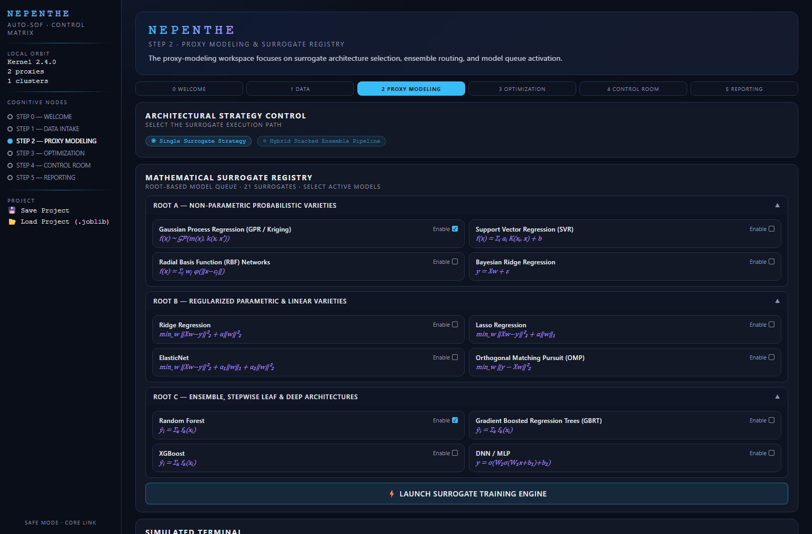
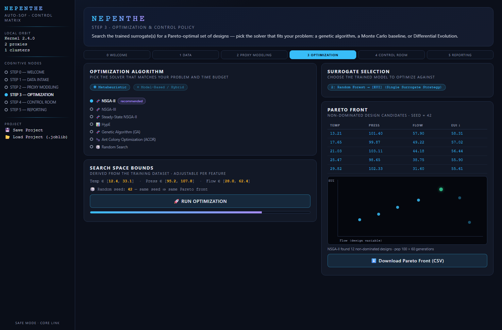

<p align="center">
  <h1 align="center">NEPENTHE&nbsp;|&nbsp;Auto-SOF</h1>
  <p align="center">
    <b>A</b>utomated <b>S</b>urrogate-based <b>O</b>ptimization <b>F</b>ramework
  </p>
  <p align="center">
    A no-code, six-step Streamlit workspace that takes a spreadsheet of engineering data<br>
    from <i>raw CSV → cross-validated surrogate models → Pareto-optimal designs → decision package</i>.
  </p>
  <p align="center">
    <a href="https://www.python.org/"></a>
    <a href="https://streamlit.io/"></a>
    <a href="LICENSE"></a>
    <a href="https://github.com/Alirezza18/nepenthe-auto-sof/stargazers"></a>
  </p>
</p>

---

**Auto-SOF** (Surrogate-based Optimization Framework) is the open-source core of the
[NEPENTHE](https://github.com/Alirezza18) research platform. It automates the standard
surrogate-based optimization loop used in simulation-driven design:

> fit cheap statistical emulators ("surrogates") to expensive simulation data,
> optimize **against the surrogates**, and hand the engineer a Pareto front
> of candidate designs — all in one browser session, with no code required.

## At a glance

| | |
|---|---|
| **Workflow** | Six guided steps: Welcome & Diagnostics → Data Intake → Proxy Modeling → Optimization → Control Room → Reporting |
| **Surrogate registry** | 21 models across three families: probabilistic (GPR/Kriging, SVR, RBF, Bayesian Ridge), regularized linear (Ridge, Lasso, ElasticNet, OMP, LARS), ensemble & deep (RF, GBRT, XGBoost/LightGBM/CatBoost aliases, AdaBoost, Extra Trees, MLP, 1D-CNN, LSTM, TabNet, EBM) |
| **Ensembling** | Single-model or **hybrid stacked ensemble** with out-of-fold meta-learning, per-fold live progress |
| **Validation** | Held-out 80/20 test metrics **plus optional 5-fold cross-validation** (mean ± std R², RMSE per target) |
| **Optimizers** | 10 solvers, including from-scratch **NSGA-II, NSGA-III, Steady-State NSGA-II, HypE**, GA, continuous ACO (ACOR), Random Search, SciPy Differential Evolution, and two **surrogate-assisted** loops (RBFMOpt-style, ANN-assisted) |
| **Interpretability** | Model-agnostic permutation feature importance (works for the stacked ensemble too) |
| **Outputs** | Pareto front table + plot, CSV/Markdown/Excel exports (CSV-zip fallback if openpyxl is absent) |
| **Reproducibility** | Every solver draws randomness from an explicit local seed — same seed ⇒ same Pareto front |
| **Session persistence** | Save/restore the whole session (data + models + results) as a single `.joblib` project file |

## Why Auto-SOF exists

Surrogate-based optimization is the workhorse of simulation-driven engineering — but the
published workflow usually lives in scattered scripts or paid platforms. Auto-SOF packages
the entire loop into a single auditable Streamlit app:

- **Zero-code operation.** Upload a dataset, tick targets, click through six steps.
- **Honest statistics.** Cross-validated metrics instead of a single optimistic holdout score;
  the stacked ensemble reports its internal out-of-fold resampling.
- **Solver choice with guidance.** Ten algorithms side by side, each with a plain-language
  explanation and a full convergence/robustness comparison table in the app.
- **Graceful degradation.** One failing model doesn't sink the run — failures are logged
  and the queue continues; missing optional packages fall back automatically.
- **Small footprint.** Pure NumPy implementations of NSGA-II/III, Steady-State NSGA-II and
  HypE — no heavy metaheuristic frameworks required.

## The optimization engine

All ten solvers share one convention: `result.X` (decision variables) and `result.F`
(objective values, natural units) on the returned non-dominated front. Randomness is
routed exclusively through local `numpy.random.Generator` instances seeded from the UI,
so runs are bit-for-bit reproducible.

| Category | Solver | Strength |
|---|---|---|
| Metaheuristic | **NSGA-II** | General-purpose default; robust on rugged tree-ensemble landscapes (Deb et al., 2002) |
| Metaheuristic | **NSGA-III** | Reference-point selection for many-objective (4+ targets) problems (Deb & Jain, 2014) |
| Metaheuristic | **Steady-State NSGA-II** | One-at-a-time replacement; converges in fewer evaluations under tight budgets |
| Metaheuristic | **HypE** | Hypervolume-indicator selection for many-objective fronts (Bader & Zitzler, 2011) |
| Metaheuristic | **Genetic Algorithm** | Real-coded GA with weighted-sum scalarization — fast, simple baseline |
| Metaheuristic | **Ant Colony (ACOR)** | Continuous-domain ACO via solution archive + Gaussian sampling |
| Metaheuristic | **Random Search** | Zero-tuning Monte Carlo baseline / sanity check |
| Model-based | **Differential Evolution** | SciPy DE across weighted scalarizations — excels on smooth continuous surrogates |
| Model-based | **RBFMOpt (RBF-assisted)** | Fits a cheap RBF interpolant on the fly; ideal if real evaluations are expensive |
| Model-based | **ANN-assisted** | Same SBO loop with a small MLP as the internal meta-surrogate |

<details>
<summary><b>What the app actually does in each step</b></summary>

1. **Welcome & Diagnostics** — engine status panel and telemetry.
2. **Data Intake** — CSV/XLSX upload with automatic encoding detection (chardet), demo-data
   toggle, data-quality report (missing values, constant columns), multicollinearity
   screening (|r| > 0.95 warnings), target/feature assignment, multi-output support.
3. **Proxy Modeling** — pick single or hybrid stacked strategy, tick models from the
   21-entry registry (formulas shown in-app), optional 5-fold CV, live per-model and
   per-fold progress, error containment per model.
4. **Optimization** — choose solver + objective directions (min/max per target), adjustable
   per-feature bounds, master seed, full solver comparison table, live generation progress,
   Pareto table + 2-objective scatter plot, CSV export.
5. **Control Room** — live design sliders feeding the surrogate in real time; load any
   Pareto design straight onto the sliders; per-target R² confidence readouts.
6. **Reporting** — model performance ledger (holdout + CV), permutation feature importance
   with bar chart, optimization summary (best design per objective), and the exportable
   decision package (Markdown / Excel / CSV-zip fallback).

</details>

## Screenshots

> Six-step workflow, dark "control room" theme. *Rendered from the app's own stylesheet (`ui/styles.css`); the HTML sources sit next to the images.*

| Proxy Modeling — 21-model surrogate registry with live training log | Optimization — ten solvers, reproducible seeds, Pareto front |
|:---:|:---:|
|  |  |

## Quickstart

```bash
git clone https://github.com/Alirezza18/nepenthe-auto-sof.git
cd nepenthe-auto-sof
pip install -r requirements.txt
streamlit run app.py
```

Then open the URL Streamlit prints (usually `http://localhost:8501`).
Tick **Try with Demo Data** in Step 1 to explore the full workflow without a dataset.

### Deploy

Free hosting: push this repo to your account and deploy on
[Streamlit Community Cloud](https://share.streamlit.io) (entry point `app.py`).
For a private server: `streamlit run app.py --server.port 8501 --server.address 0.0.0.0`.

## Tests

A dependency-free `unittest` suite covers the optimization core
(Pareto dominance logic, non-dominated sorting, NSGA-II/III selection, reproducibility,
seeded randomness, solver invariants — objective bounds, min/max directions):

```bash
python -m unittest discover -s tests -v
```

## Project structure

```
app.py                 # the full six-step Streamlit workflow
core/
  kernel.py            # engine/session-state bookkeeping & telemetry
  optimizer.py         # 10 optimization solvers (NumPy/SciPy, seeded, dependency-free)
tests/
  test_optimizer.py    # unittest suite for the optimization core
ui/styles.css          # dark "control room" theme
requirements.txt
```

## Design notes

- **Streamlit-native, notebook-free.** Colab-only widgets (`google.colab.files`,
  `ipywidgets`) were replaced with native Streamlit widgets and `st.download_button`.
- **Dependency-light explainability.** SHAP was swapped for model-agnostic permutation
  importance (shuffle-and-measure-R²-drop), which works identically for single models and
  the stacked ensemble.
- **Placeholder registry entries are transparent.** RBF, CNN, LSTM, TabNet and EBM currently
  fall back to generic tree/ensemble implementations under the hood; the registry marks them
  as *alias* models, and the roadmap lists their real implementations.
- **The surrogate is the objective.** Auto-SOF optimizes against the trained surrogate. The
  surrogate-assisted solvers also demonstrate the pattern where the true (expensive) objective
  is swapped in, minimizing real evaluation counts.

## Roadmap

- [ ] Real XGBoost / LightGBM / CatBoost backends for the alias registry entries
- [ ] Hyperparameter tuning (Optuna / RandomizedSearchCV)
- [ ] SHAP explainability + partial-dependence / ICE plots
- [ ] Constraint handling beyond box bounds
- [ ] Sobol sensitivity analysis (as sketched in the original notebook)
- [ ] Batch-scoring tab: predict on new candidate designs without retraining
- [ ] `st.cache_data` / `st.cache_resource` to avoid recomputation across steps
- [ ] Categorical feature support (currently numeric-only)

## Cite

If Auto-SOF supports your research, please cite it:

```bibtex
@software{karimi_2026_auto_sof,
  author    = {Karimi, Alireza},
  title     = {Auto-SOF: automated surrogate-based multi-objective optimization framework},
  year      = {2026},
  doi       = {},
  url       = {https://github.com/Alirezza18/nepenthe-auto-sof},
  version   = {1.0.0}
}
```

[](https://doi.org/10.5281/zenodo.XXXXXXX)

## Author & context

**[Alireza Karimi](https://github.com/Alirezza18)** — Computational Building Scientist,
PhD candidate (Architecture), Universidad de Sevilla.
Auto-SOF is one of two named research frameworks he maintains; the other,
[Urban-Future-Weather Engine](https://github.com/Alirezza18), is under active development.

- ORCID: [0000-0002-6296-9496](https://orcid.org/0000-0002-6296-9496)

## License

[MIT](LICENSE)
